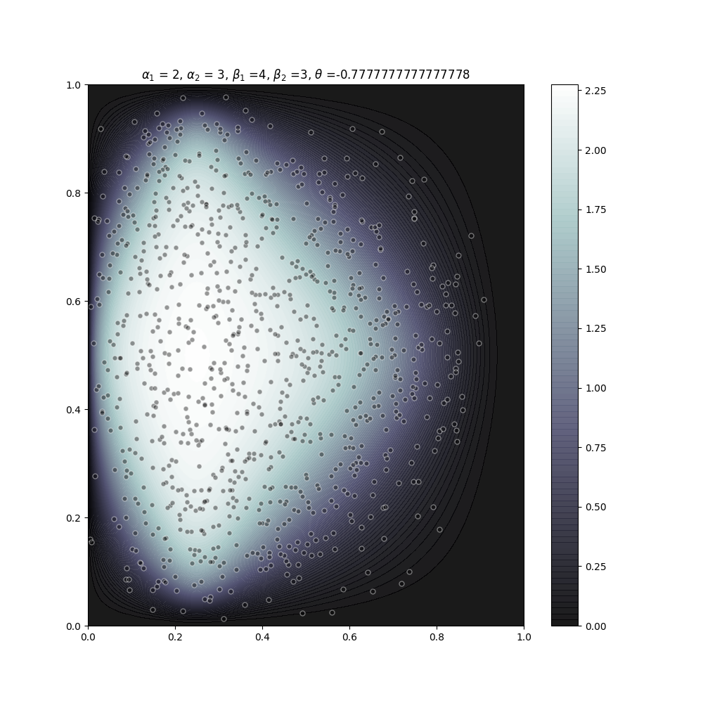

# Multibeta - Tools for multivariate distributions with Beta marginals using the Ali-Mikhail-Haq copula

Beta distributions are used, among other things, priors for Bernoulli and Binomial problems and range/mode/degree of certainty estimate elicitation with human experts. 

Joint distributions can be obtained from Beta marginals by assuming independence (the approach I used for [Greenbox](https://github.com/asemic-horizon/stanton),which targets parameter elicitation for Excel models), but it isn't trivially true that uncertain parameters should be considered unrelated. 

This repository has a few tools for dealing with *AMH/Multibeta* distributions (afaik not an existing term). The Ali-Mikhail-Haq (AMH) copula is parameterized by a single dependence parameter $\theta \in [-1,1)$ and specializes to the joint-independent distribution for $\theta = 0$. 

Included are:

* Rejection samplers for (generic) univariate, bivariate and multivariate distributions (there seems to be no widely-used, well-maintained Python package for this)
* Probability density functions for the bivariate and multivariate AMH/beta distributions
* Sampler (random generator) for the AMH/multibeta distributions
* A fun 2-d visualization.

This project is mostly written in [Hy](http://hylang.org). It can be trivially imported to Python code once you `pip install hy`. It may be useful to use `hy2py` to examine sources if you're unsure of what's going on.